<p align="center">
  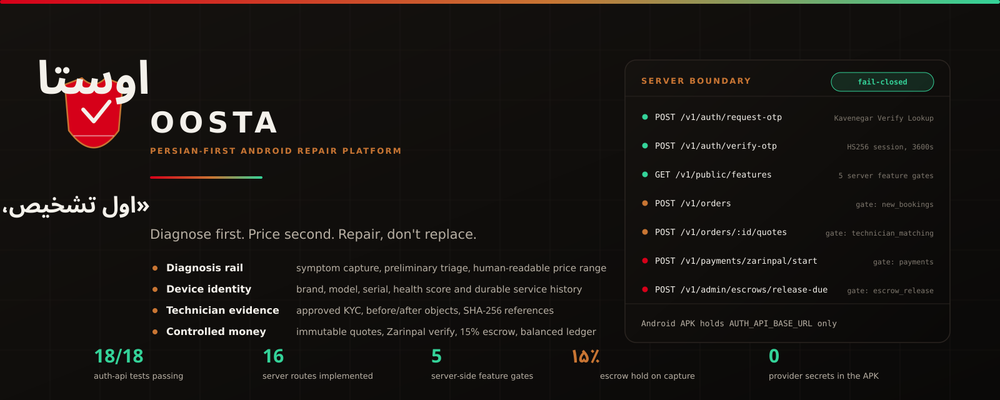
</p>

<p align="center">
  <strong>«اول تشخیص، بعد هزینه.»</strong><br/>
  <em>Diagnose first. Price second. Repair, don't replace.</em>
</p>

<p align="center">
  
  
  
  
  
  
</p>

---

## Product identity

**اوستا / Oosta** is a Persian-first Android repair platform. It is built around one sequence that Iranian workshops already trust: listen to the machine, write down what it is, prove what was done to it, and only then talk about money.

The product carries the **Ostad Kaveh** narrative — the last apprentice of Kaveh the blacksmith, whose leather apron once became a flag and here becomes a shield for honest diagnosis. The lore sets the tone; the surfaces in this repository set the claims. Every section below points at code you can open.

| Layer | What it is | Where it lives |
| --- | --- | --- |
| Android client | Single-activity Kotlin + Compose app, Persian-first, RTL-enabled | [`app/`](app/) |
| Server boundary | Fastify API owning OTP, triage, KYC, quotes, payments, ledger | [`services/auth-api/`](services/auth-api/) |
| Data | Room on device; PostgreSQL 16 with three tracked migrations on the server | [`db/`](services/auth-api/db) |
| Brand | Apron shield, Ostad Kaveh poster, palette, prompt sources | [`brand/`](brand/) |
| Narrative | Full Ostad Kaveh story and voice rules | [`docs/LORE.md`](docs/LORE.md) |

Palette: Forge Black `#0A0908` · Apron Red `#D60019` · Copper `#C87533` · Paper `#F4F1EB` · Verification Green `#34D399`.

---

## The repair-market problem

In Tehran the default answer to a broken machine is *«بنداز دور، نو بخر»* — throw it away and buy a new one. That default is expensive, and it is reinforced by four concrete failures:

1. **Price before diagnosis.** A number is quoted on the phone before anyone has heard the fault, so the number is either a guess or a hook.
2. **No device memory.** The same appliance is repaired three times by three people, and none of them can see what the previous two did.
3. **Invisible parts quality.** An "original" part and a budget substitute are quoted at the same price, and the customer learns the difference three months later.
4. **Money with no referee.** Payment happens in cash on the day, so the warranty is a promise with nothing behind it.

Oosta attacks those four failures directly: a diagnosis rail before any price, a device passport that outlives the technician, an explicit parts rack, and money that moves through recorded, balanced, server-side states.

---

## Five promises

<p align="center">
  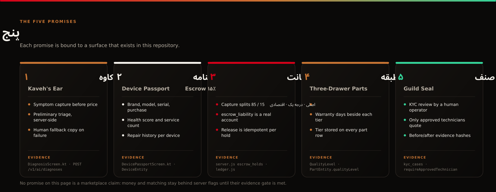
</p>

| Promise | Persian | What it obliges us to build | Implemented surface |
| --- | --- | --- | --- |
| Listening-led diagnosis | گوشِ کاوه | Symptoms are captured before any price is shown | `DiagnosisScreen.kt`, `POST /v1/ai/diagnoses` |
| Device passport | شناسنامه | A machine has an identity and a history | `DeviceEntity`, `DevicePassportScreen.kt` |
| Escrow | پولِ امانت | 15% of every captured payment is held, not spent | `escrow_holds`, `ledger.js` |
| Three-drawer parts | کشوی سه‌طبقه | Tier, price and warranty are shown side by side | `QualityLevel`, `PartEntity` |
| Guild seal | مُهر صنف | Only human-verified technicians may work and be paid | `kyc_cases`, `requireApprovedTechnician()` |

---

## Android experience

<p align="center">
  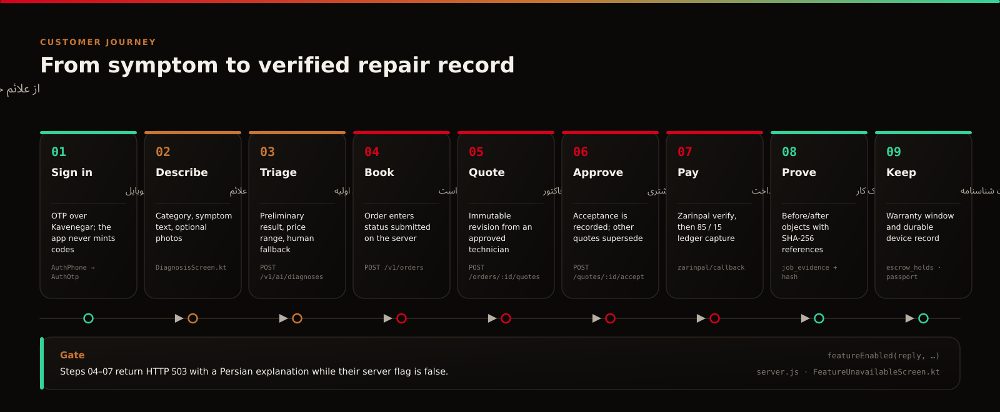
</p>

The app opens on authentication, not on a dashboard: `MainActivity` sets `Screen.AuthPhone` as the start destination, so an unauthenticated user has no path into order or money surfaces. After verification, Navigation Compose exposes five primary destinations — خانه, پاسپورت, ضمانت‌ها, دستیار, حساب من — plus the booking, matching, tracking, passport, parts, wallet and technician routes.

Persian is the first language of the UI, not a translation layer: copy, currency formatting and Persian digits are authored directly in the Compose sources, and `android:supportsRtl="true"` is set in the manifest.

<p align="center">
  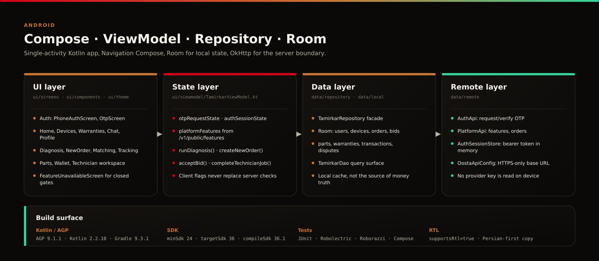
</p>

- **UI layer** — `ui/screens`, `ui/components`, `ui/theme`; `FeatureUnavailableScreen` renders a calm Persian explanation whenever a server gate is closed.
- **State layer** — `TamirkarViewModel` holds `otpRequestState`, `authSessionState` and `platformFeatures`, and refuses to submit an order when `new_bookings` is false.
- **Data layer** — `TamirkarRepository` over Room tables for users, devices, orders, bids, parts, warranties, transactions and disputes.
- **Remote layer** — `AuthApi`, `PlatformApi`, `AuthSessionStore` and `OostaApiConfig`, which rejects a blank, placeholder or plain-HTTP base URL outside a debug emulator build.

Screen-by-screen notes live in [`docs/SCREENS.md`](docs/SCREENS.md).

---

## Diagnosis flow

<p align="center">
  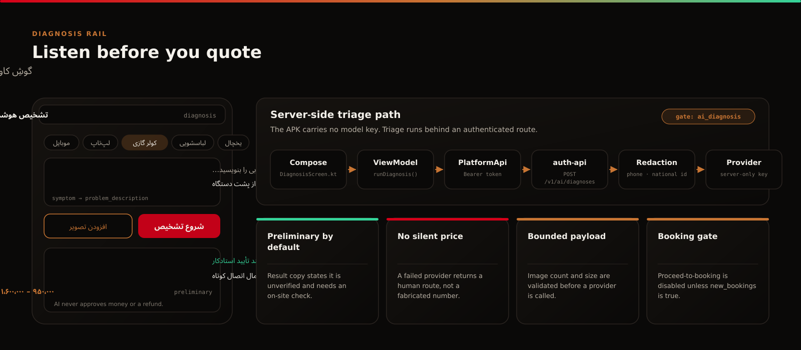
</p>

The diagnosis rail is the product's opening move. The customer picks a category, writes the symptom in Persian, optionally attaches photographs, and receives a **preliminary** reading with a price range — clearly labelled as preliminary and requiring an on-site check.

Triage runs behind the server boundary. The APK holds no model credential; the request travels `DiagnosisScreen → TamirkarViewModel.runDiagnosis() → PlatformApi (Bearer token) → POST /v1/ai/diagnoses`, where the service redacts common phone and national-ID patterns before a provider sees the text, validates image count and size, and returns a human support route when the provider is unavailable.

Two rules are enforced in code rather than promised in copy: no AI output can approve a refund or release money, and the proceed-to-booking action stays disabled while the `new_bookings` flag is false.

---

## Device passport

<p align="center">
  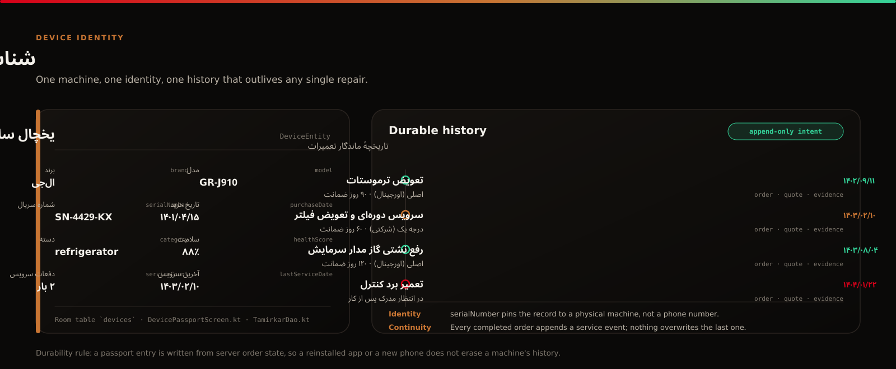
</p>

A passport turns "a broken fridge" into a specific machine with a record. `DeviceEntity` stores brand, model, serial number, category, purchase date and price, health score, service count and last service date; `DevicePassportScreen` presents that identity above a chronological repair history.

The history is written from server-side order state — order, quote revision and evidence — so each completed repair appends an event instead of overwriting the last one. Reinstalling the app or changing phone does not erase what happened to the machine, and the same record is what a warranty claim or a resale conversation is argued from.

---

## Technician matching

<p align="center">
  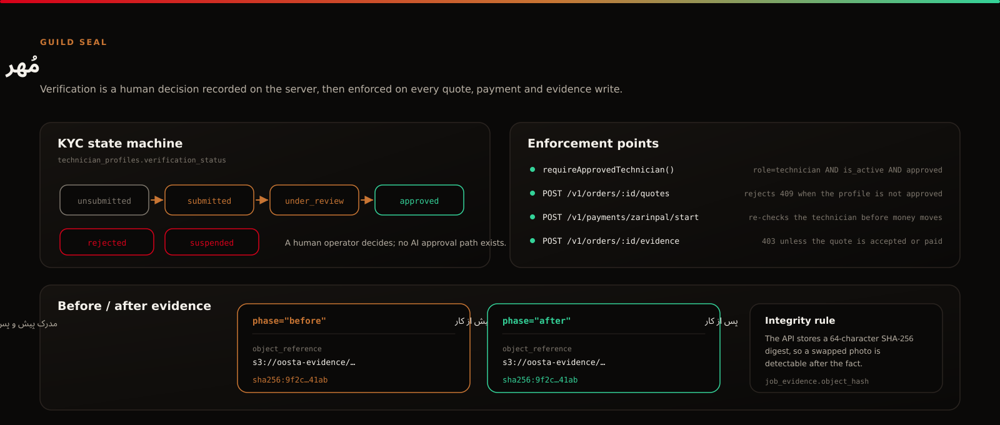
</p>

Verification is a human decision recorded on the server. `technician_profiles.verification_status` moves `unsubmitted → submitted → under_review → approved`, with `rejected` and `suspended` as operator outcomes; `kyc_cases` records the review itself. There is no automated approval path.

Approval is then enforced at every point where it matters — `requireApprovedTechnician()` guards quote creation and payment start, and evidence writes return `403` unless the requesting technician owns an accepted or paid quote for that order. Before/after evidence is stored as an object reference plus a 64-character SHA-256 digest, so a later substitution is detectable.

---

## Parts tiers

<p align="center">
  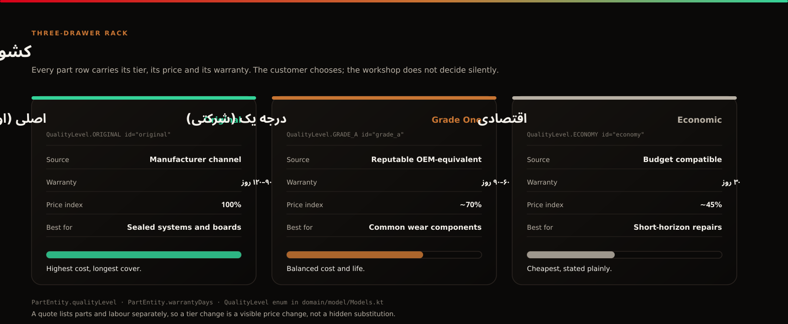
</p>

The three-drawer rack is the anti-substitution mechanism. `QualityLevel` defines exactly three tiers — `original` (اصلی/اورجینال), `grade_a` (درجه یک/شرکتی) and `economy` (اقتصادی) — and every `PartEntity` row carries its tier, price and warranty days.

Because a quote itemises labour and parts separately (`labor_tomans`, `parts_tomans`, `line_items`), switching a tier is a visible change in the quote total rather than a silent swap inside the machine.

---

## Warranty and dispute flow

<p align="center">
  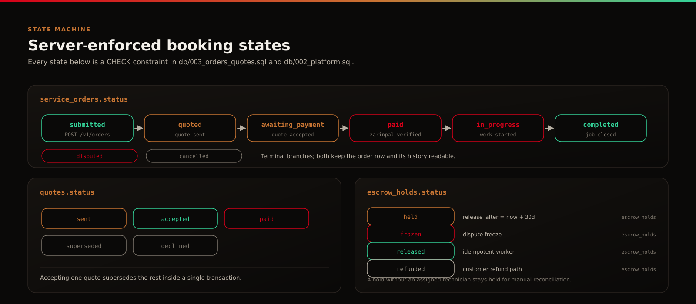
</p>

Order state is a database constraint, not an app convention: `service_orders.status` is restricted to `submitted`, `quoted`, `awaiting_payment`, `paid`, `in_progress`, `completed`, `disputed`, `cancelled`. Quotes are immutable revisions (`sent`, `accepted`, `superseded`, `declined`, `paid`) and accepting one supersedes the rest inside a single transaction with a recorded `quote_acceptances` row.

<p align="center">
  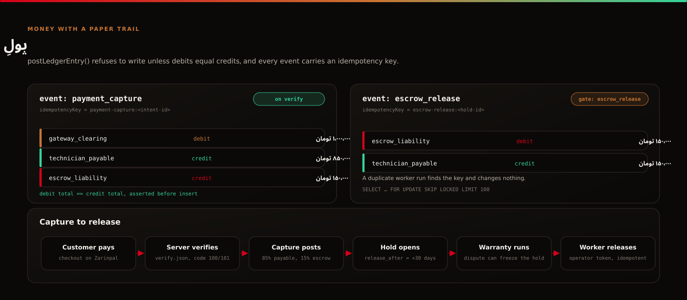
</p>

Money follows the same discipline. On a verified Zarinpal payment, `postLedgerEntry()` writes one balanced event — debit `gateway_clearing` for the full amount, credit `technician_payable` 85%, credit `escrow_liability` 15% — and opens an `escrow_holds` row with `release_after = NOW() + 30 days`. The entry refuses to write unless debits equal credits, and each event is keyed (`payment-capture:<intent-id>`, `escrow-release:<hold-id>`), so a replayed callback or a duplicated worker run changes the ledger exactly once.

Time alone never pays a technician. `release-due` joins through the payment intent and quote to the order and releases only when `service_orders.status = 'completed'`; completion itself requires both a `before` and an `after` evidence record. A customer or operator can dispute a paid, in-progress or completed order, which freezes the hold and writes a balanced `dispute_freeze` event that claws the technician's 85% back into `escrow_liability`. An operator can then refund a held or frozen hold with an `escrow-refund:<hold-id>` ledger event; replaying it is a `409`. A hold without an assigned technician stays held for manual reconciliation.

---

## OTP architecture

<p align="center">
  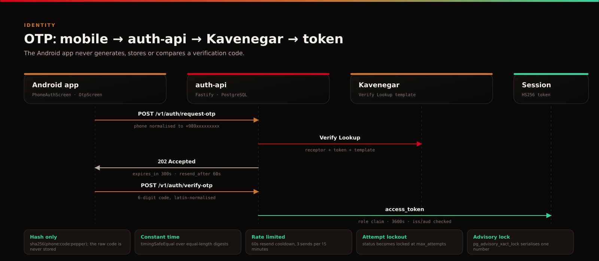
</p>

Login is the one capability intended for the earliest pilot, and it is fully server-side:

1. `POST /v1/auth/request-otp` normalises the number to `+989xxxxxxxxx` (Persian and Arabic-Indic digits included), takes a transaction advisory lock, and stores only `sha256(phone:code:pepper)`.
2. The service calls **Kavenegar Verify Lookup** with its own API key and template; the app never sees the credential or the code.
3. `POST /v1/auth/verify-otp` compares digests with `timingSafeEqual`, enforces expiry, attempt limits and lockout, then creates or loads the user and writes an `auth.verified` audit row.
4. The response carries an HS256 access token — `sub` and `role` only, 3600 seconds, with issuer and audience verified on every protected request.

Rate limits are concrete: a 60-second resend cooldown, at most three sends per 15-minute window, a five-minute code lifetime and `status = locked` when attempts are exhausted.

---

## Backend foundations

<p align="center">
  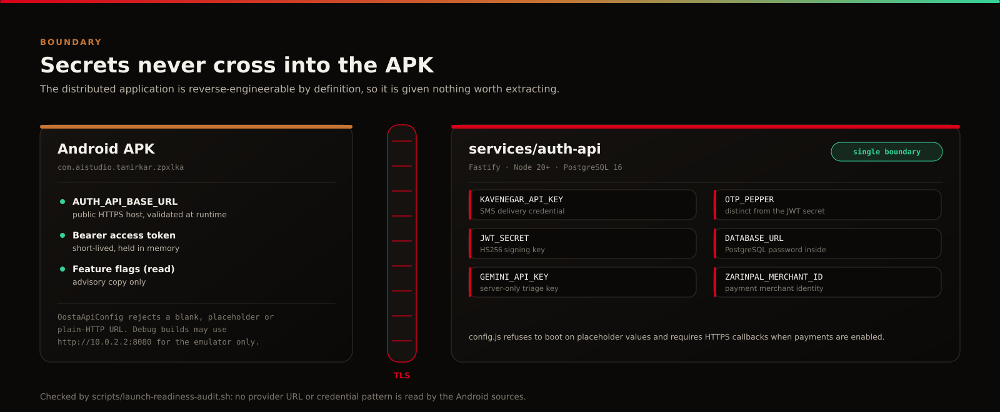
</p>

`services/auth-api` is the single server boundary: Fastify on Node 20+, PostgreSQL 16, five tracked migrations (`001_auth.sql` … `005_devices.sql`, each with a matching `db/down/` rollback) and twenty-seven routes covering health, metrics, public feature state, OTP, identity, triage, technician application and KYC, admin KYC decisions, order listing and detail, order lifecycle (`start`, `complete`, `dispute`), the device passport (`GET`/`POST /v1/devices`, `GET /v1/devices/:id`), account erasure (`DELETE /v1/me`), quotes, quote acceptance, evidence, Zarinpal start and callback, escrow release and escrow refund.

The Android application is given exactly one non-secret value, `AUTH_API_BASE_URL`. `KAVENEGAR_API_KEY`, `OTP_PEPPER`, `JWT_SECRET`, `DATABASE_URL`, `GEMINI_API_KEY` and `ZARINPAL_MERCHANT_ID` stay in the service environment, and `config.js` refuses to boot on placeholder values or on payments without an HTTPS callback. Full contract: [`docs/API.md`](docs/API.md); schema: [`docs/DATABASE.md`](docs/DATABASE.md).

---

## Feature gating

Five capabilities are switched server-side and published read-only to the client at `GET /v1/public/features`:

| Flag | Default | Guarded routes | Client behaviour when false |
| --- | --- | --- | --- |
| `ai_diagnosis` | false | `POST /v1/ai/diagnoses` | Diagnosis returns a human route instead of a result |
| `new_bookings` | false | `POST /v1/orders`, `POST /v1/quotes/:id/accept` | Booking actions disabled with a Persian explanation |
| `technician_matching` | false | `POST /v1/orders/:id/quotes` | Matching and technician workspace show `FeatureUnavailableScreen` |
| `payments` | false | `POST /v1/payments/zarinpal/start` | Payment entry points stay closed |
| `escrow_release` | false | `POST /v1/admin/escrows/release-due` | The release worker is a no-op |

A closed gate answers `503` with `{"error":"feature_unavailable"}` and a Persian message. The client's copy of the flags is advisory only — every protected route re-checks the flag, the session and the role on the server.

---

## Security controls

- **Fail-closed configuration.** `loadConfig()` rejects missing or placeholder secrets and refuses to enable payments without a merchant ID and an HTTPS callback base URL.
- **Least-privilege sessions.** Tokens carry `sub` and `role` only, live one hour, and are validated for algorithm, issuer and audience. Roles are `customer`, `technician`, `operator`, `admin`.
- **OTP secrecy.** Codes exist only as peppered SHA-256 digests; logs reference a truncated HMAC of the phone number, never the number or the code.
- **Transport and headers.** HTTPS-only base URL on device, `x-content-type-options: nosniff`, `cache-control: no-store`, and CORS limited to `ALLOWED_ORIGINS`.
- **Money integrity.** Idempotency keys on payment intents and ledger events, `SELECT … FOR UPDATE` on every state transition, and `FOR UPDATE SKIP LOCKED` batching in the release worker.
- **Payment verification.** Callback query data is never trusted; the service re-verifies against Zarinpal `verify.json` and treats code `101` as an idempotent success.
- **Audit trail.** `operational_audit_log` records auth verification, order submission, quote send/accept, payment creation and verification, and escrow release.

Disclosure policy: [`SECURITY.md`](SECURITY.md). Risk ledger: [`RISK_REGISTER.md`](RISK_REGISTER.md).

---

## Tests

<p align="center">
  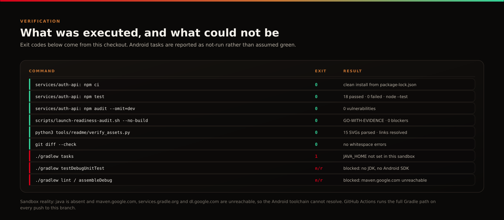
</p>

**Server — executed in this checkout.** `npm ci` then `npm test` runs the Node test runner across eleven suites: **37 tests, 37 passed, 0 failed** with `AUDIT_DATABASE_URL` set (33 passed, 4 skipped without it). They cover Iranian phone normalisation, OTP hashing and constant-time comparison, session claims and rejection of invalid roles, feature-flag exposure, fail-closed configuration (including the refusal to log OTP codes in production), balanced and idempotent ledger postings, Zarinpal request/verify semantics, AI redaction, retry/backoff classification and circuit-breaker state, rate-limiter windows, and HTTP-level behaviour of the server routes. Two suites are integration lanes that boot the real server against a disposable PostgreSQL: one walks the money path (completion gate, dispute freeze, refund replay, ledger balance), the other the device passport, the KYC gate, account erasure and the AI rate limit. `npm audit --omit=dev` reports **0 vulnerabilities**, and [`node --test --experimental-test-coverage`](services/auth-api) reports the measured line coverage. `.github/workflows/server.yml` runs all of it on every push to `main` and on every pull request.

**Android — defined in the repository, executed in CI.** `app/src/test` holds `AiProviderRouterTest`, `ExampleRobolectricTest`, `ExampleUnitTest` and `GreetingScreenshotTest` (Robolectric 4.16 on SDK 35 with a Compose render assertion), plus an instrumented `ExampleInstrumentedTest`. A Gradle test listener converts failures into GitHub Actions annotations.

**Readiness audit — executed.** `scripts/launch-readiness-audit.sh --no-build` completed with **exit 0 / GO-WITH-EVIDENCE, 0 blockers**, confirming the server AI boundary, server payment and ledger paths, the idempotent escrow-release path, the KYC workflow, the non-destructive migration path and RTL support. Reports land in `audit-output/` (git-ignored).

Testing guide: [`docs/TESTING.md`](docs/TESTING.md).

---

## Build and pilot deployment

<p align="center">
  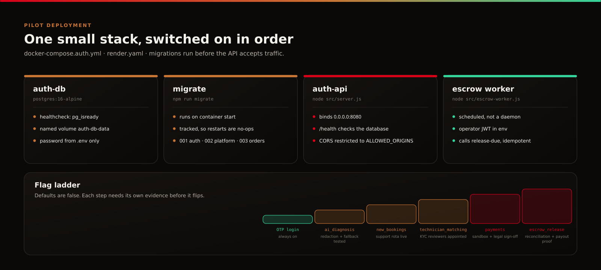
</p>

**Android**

```bash
# The APK is allowed to know exactly one non-secret value. Without it every server call fails
# at runtime, because OostaApiConfig deliberately rejects a blank or placeholder base URL.
export AUTH_API_BASE_URL=https://your-auth-api-host      # or: -PAUTH_API_BASE_URL=... per build

./gradlew testDebugUnitTest     # unit + Robolectric tests
./gradlew lint                  # Android lint
./gradlew assembleDebug         # app/build/outputs/apk/debug/*.apk
```

`AUTH_API_BASE_URL` is declared as a `buildConfigField` in [`app/build.gradle.kts`](app/build.gradle.kts) and may also be supplied through a root `.env` file, which is git-ignored. `http://10.0.2.2:8080` is accepted only in a debug emulator build.

Requires JDK 17, Android SDK platform 36/36.1 and build-tools 36.0.0; Gradle 9.3.1 arrives through the wrapper. CI provisions exactly that toolchain in [`.github/workflows/build.yml`](.github/workflows/build.yml) and uploads the debug APK as an artefact.

**Server**

```bash
cd services/auth-api
cp .env.example .env            # then generate real secrets
npm ci && npm test
cd ../..
docker compose -f docker-compose.auth.yml --env-file services/auth-api/.env up --build
curl http://localhost:8080/health
curl http://localhost:8080/v1/public/features
```

The API container runs `npm run migrate` before serving; migration tracking makes later starts no-ops. The escrow worker (`src/escrow-worker.js`) is a scheduled one-shot process that calls `release-due` with an operator token. A managed deployment blueprint is in [`render.yaml`](render.yaml), and the flag ladder — OTP first, then triage, bookings, matching, payments, escrow release — is documented in [`docs/DEPLOYMENT.md`](docs/DEPLOYMENT.md) and [`docs/FREE_TIER_PILOT_BLUEPRINT.md`](docs/FREE_TIER_PILOT_BLUEPRINT.md).

**README visual system**

```bash
python3 tools/readme/build_assets.py     # regenerate assets/readme/*.svg
python3 tools/readme/verify_assets.py    # parse, palette, overflow and link checks
```

---

## Documentation map

| Area | Documents |
| --- | --- |
| Product | [`docs/README.md`](docs/README.md) · [`docs/SCREENS.md`](docs/SCREENS.md) · [`docs/BUSINESS_LOGIC.md`](docs/BUSINESS_LOGIC.md) · [`docs/LORE.md`](docs/LORE.md) |
| Engineering | [`docs/ARCHITECTURE.md`](docs/ARCHITECTURE.md) · [`docs/API.md`](docs/API.md) · [`docs/DATABASE.md`](docs/DATABASE.md) · [`docs/ENVIRONMENT.md`](docs/ENVIRONMENT.md) |
| Launch | [`LAUNCH_AUDIT.md`](LAUNCH_AUDIT.md) · [`LAUNCH_CHECKLIST.md`](LAUNCH_CHECKLIST.md) · [`docs/GO_NO_GO.md`](docs/GO_NO_GO.md) · [`docs/GO_60_ROADMAP.md`](docs/GO_60_ROADMAP.md) |
| Trust | [`SECURITY.md`](SECURITY.md) · [`RISK_REGISTER.md`](RISK_REGISTER.md) · [`docs/legal/TERMS_FA.md`](docs/legal/TERMS_FA.md) · [`docs/legal/PRIVACY_FA.md`](docs/legal/PRIVACY_FA.md) · [`docs/legal/WARRANTY_FA.md`](docs/legal/WARRANTY_FA.md) |
| Contribution | [`CONTRIBUTING.md`](CONTRIBUTING.md) · [`CODE_OF_CONDUCT.md`](CODE_OF_CONDUCT.md) · [`LICENSE`](LICENSE) |

---

<p align="center">
  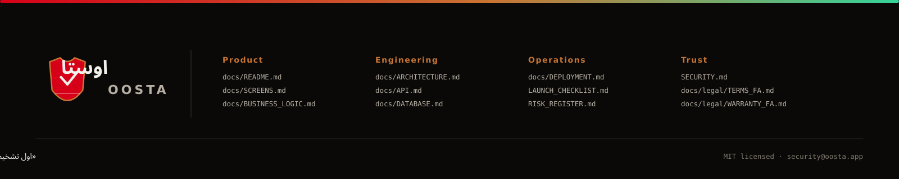
</p>
